# RN Firebase Chat App

## Background

In the evening of 17th June, 2021, I decided that I would attempt another 4 day weekend mobile app building challenge. I wanted to learn how to use firebase's authentication and realtime database with React Native. So I decided I would build a chat app, which requires both technologies, account management and realtime data processing.

This project took approximately 4 days to complete. I worked around 14 to 15 hours a day, so effectively, this project took around 56 to 60 hours. I also spent one extra day to work on the documentation, screenshots, and the README file.

Below includes a detailed breakdown of the areas that I worked on each day.

### Workflow and Schedule

- Day 1
    - Planning
    - Account system logic and UI integration
        - Sign up and sign in
        - Password reset
- Day 2
    - Account details editing
    - Firebase realtime database manipulation
- Day 3
    - "Add Friend" mechanic implementation
        - UID QRCode generation
        - QRCode scanning
        - Pop-up modal design
- Day 4
    - Realtime chat function
    - Added value listeners to account details
    - Release
- Day 5
    - Documentation and readme finalisation

## Gallery

Below are some screenshots showcasing the app (android)

|        Home (Landing)        |             Chat              |             Chat              |      Friend's Account View      |
| :--------------------------: | :---------------------------: | :---------------------------: | :-----------------------------: |
| 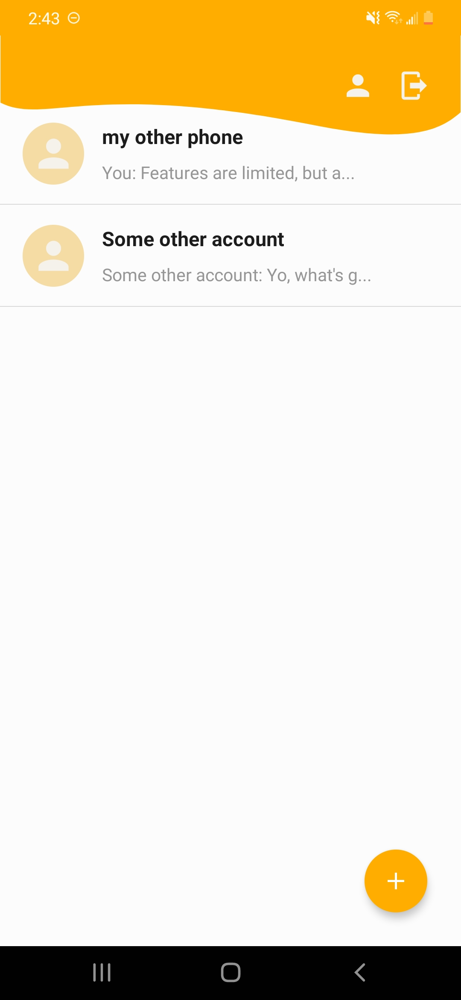 | 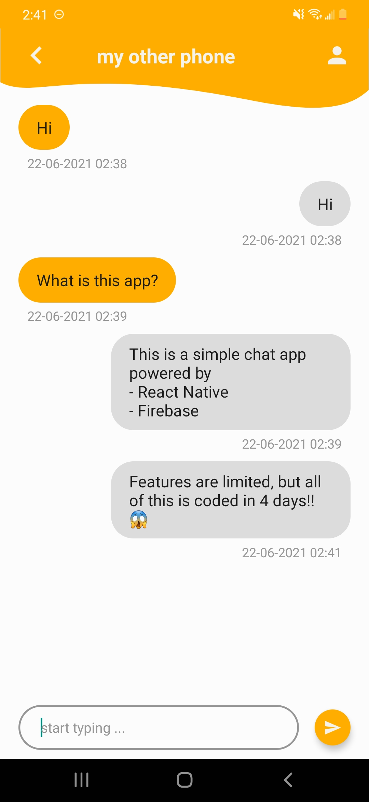 | 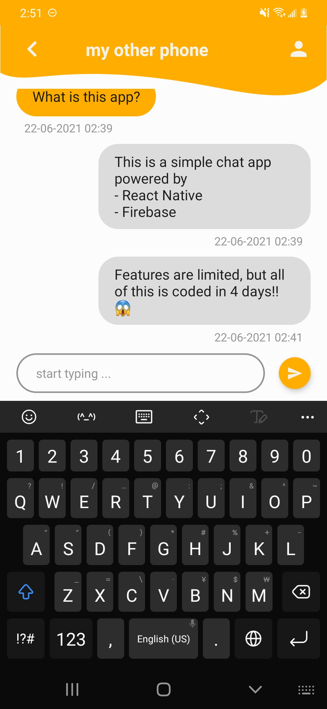 | 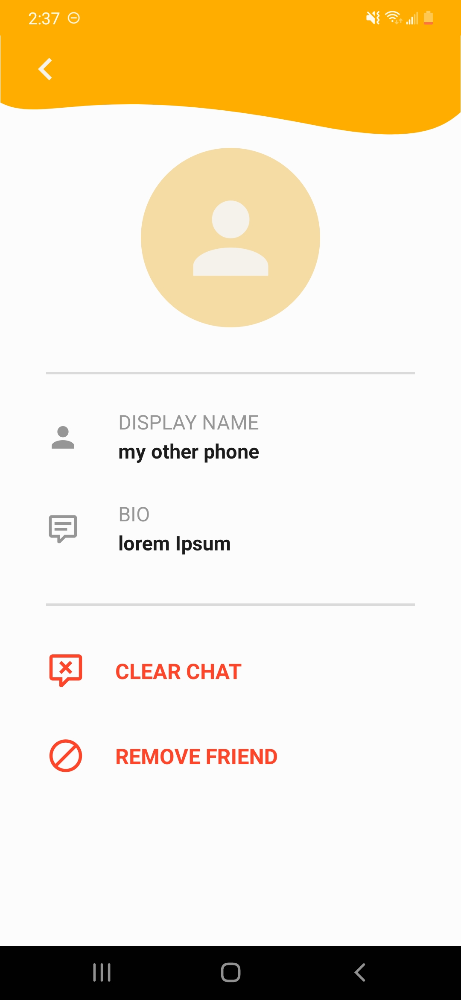 |

## Technical Details

### Authentication Flow

The authentication flow of the app is done by selectively rendering two sets of screens based on whether the user is logged in.

### Realtime Database

Apart from the user's account, everything is dynamically loaded. Each component listens to branches of the firebase JSON tree that contains information it needs. So whenever that values mutate, the component will be able to render and update itself.

Dynamic loading is also used in the chat screen. As this is a chat app, it is expected for a large amount of messages to be exchanged and having to download the entire subtree of messages would hinder the application's performance. To deal with this issue, only the latest messages will be fetched on the initial render. And if the user wishes to load previous messages, scrolling to the top of the chat and refreshing will pull more messages from the database.

### Friend Adding System

QRCode scanning is used for adding contacts. The user's UID is encoded into a QRCode, other people can use the app's in-app scanner to scan the code. On detection, the database will be updated and the contacts will immediately appear on the home screen of both users.

### Libraries Used

Below is a list of all the node packages used for the project that are worth noting

- firebase
- react-native-qrcode-scanner (and all of its subsequent packages)
  - react-native-camera
  - react-native-permissions
- react-native-qrcode-svg
- react-native-svg
- react-navigation (and all of its subsequent packages)
  - the stack navigation package
- redux (and all of its subsequent packages)
  - react-redux
    - redux-persist
    - react-native-async-storage

## More Screenshots

Below are some more screenshots taken from the app (android)

|        Login (Landing)        |         Create Account         |             Sign Up             |        Password Reset         |
| :---------------------------: | :----------------------------: | :-----------------------------: | :---------------------------: |
| 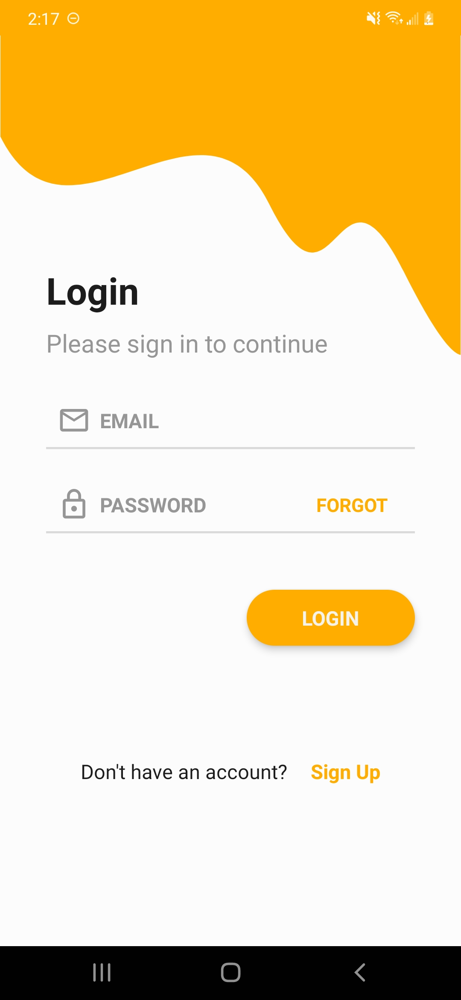 | 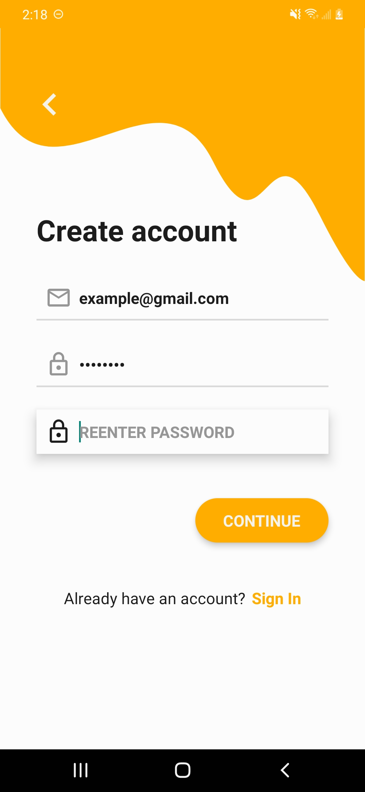 | 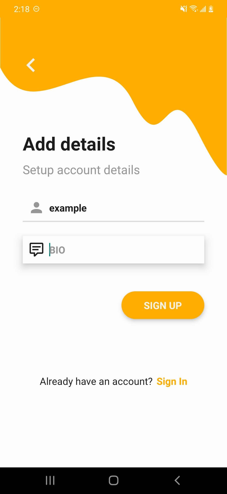 | 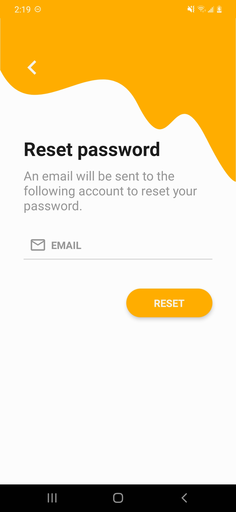 |

|         My Account          |     Account Detail Editing      |        QRCode Scanner         |       QRCode Generation        |
| :-------------------------: | :-----------------------------: | :---------------------------: | :----------------------------: |
| 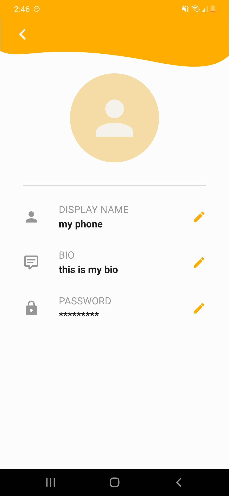 | 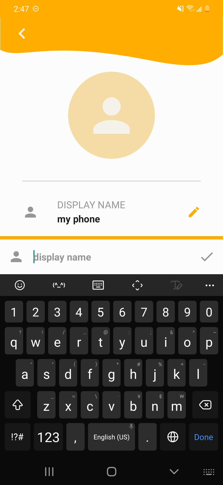 | 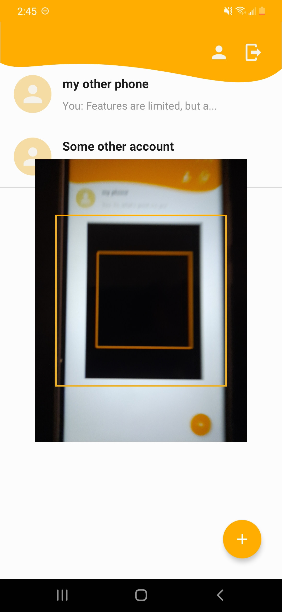 | 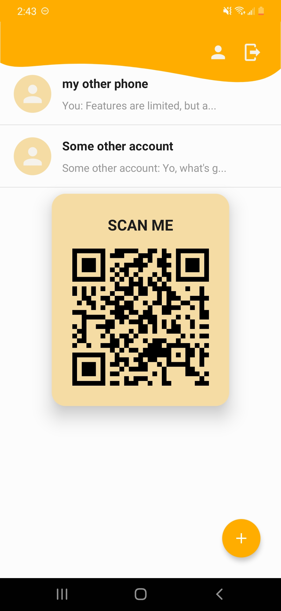 |

## Maintenance and Future Updates

As of now, there are no plans to maintain nor further develop this project, as this is only a weekend sprint build.

Althought there is no incentive to do so, the way to app is coded and designed is prepared for future expansion. Data dependency is well managed and minimal (no circular referencing and dependencies). The code base has been abstracted and components are very reusable.

But for those curious people out there who wishes to give it a test, a release .apk is <a href='https://github.com/lochungtin/RNFirebaseChat/releases/tag/v1.0.0'>attached</a> in the release page of this repo.
